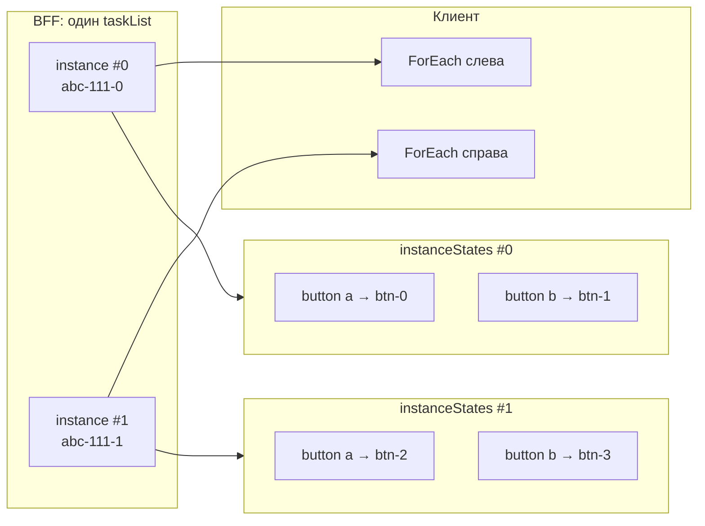
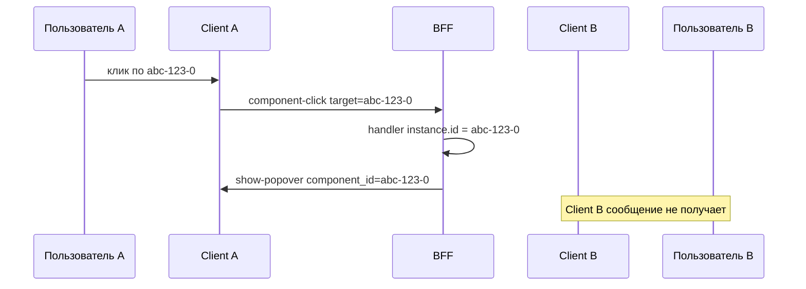
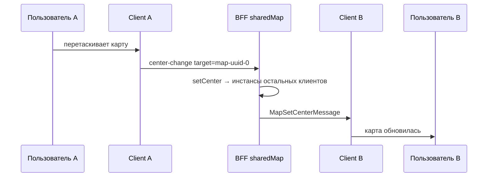

# Component и ComponentInstance

> **Уровень: advanced.** Раздел для сценариев, где один BFF-`Component` сериализуется несколько раз, нужна точная привязка к DOM (`showPopover`, native picker) или понимание `target` в component commands. Для старта достаточно [components-basics.md](../guides/components-basics.md), [events-and-actions.md](../guides/events-and-actions.md) и [platforms.md](../reference/platforms.md); сюда имеет смысл вернуться, когда переиспользуете один объект в нескольких местах UI или отлаживаете доставку команд.

В matreshka на BFF существует **один объект** `Component`, но на клиенте он может появиться **несколько раз** — в разных местах дерева, после ререндера или на разных entry. Чтобы различать эти экземпляры UI, введён `ComponentInstance`.

## Основные понятия

### Component (BFF)

`Component` — серверный объект в DSL: `button`, `stack`, `forEach`, `map` и т.д.

- создаётся один раз в коде BFF;
- имеет **базовый** `id` (`crypto.randomUUID()`), общий для всех инстансов;
- хранит свойства, обработчики, `Context`-связи;
- при каждом вызове `serialize()` попадает в конфиг клиента как отдельная запись с **instance id**.

Один и тот же `Component` на сервере — это одна логическая сущность. Если вы сохранили ссылку на кнопку в переменную и вставили её в два места страницы, обработчики и состояние BFF-объекта общие, но клиент получит **два** конфига с разными id.

### ComponentInstance

`ComponentInstance` описывает **одно** появление server-компонента в UI конкретного клиента.

```ts
class ComponentInstance<ComponentType = unknown> {
  readonly id: string; // instance id (назначается в createInstance)
  readonly component: ComponentType; // BFF-объект
  get client(): Client | undefined; // после единственной serialize
  get entry(): EntryComponent | undefined; // entry-владелец дерева — после serialize
}
```

**Одноразовая сериализация:** `instance.serialize()` вызывается **ровно один раз**. Повторный вызов бросает ошибку. Обновить уже отправленный конфиг тем же instance id нельзя — только команды BFF→client или новый инстанс.

`client` и `entry` закрепляются в момент этой сериализации.

### Instance id

Id инстанса назначается в **`createInstance()`** (или при неявном создании инстанса внутри `Component.serialize()`) и имеет вид **`{baseId}-{N}`**:

- `550e8400-e29b-41d4-a716-446655440000-0` — первый инстанс;
- `550e8400-e29b-41d4-a716-446655440000-1` — второй инстанс;
- и т.д.

Суффикс `-N` монотонно растёт на BFF-объекте. **Базовый id** — часть до суффикса. На клиент конфиг попадает при **единственной** `serialize()` этого instance.

Клиент регистрирует конфиг в `ComponentHub` по **instance id** и создаёт Angular-инстанс с этим id. Все client→BFF interaction-сообщения (`click`, `submit`, `show`, `hide`, …) отправляют в `target` именно instance id того DOM-узла, где произошло событие.

### Component vs ComponentInstance

|                     | `Component`          | `ComponentInstance`                                            |
| ------------------- | -------------------- | -------------------------------------------------------------- |
| Где живёт           | BFF (сервер)         | Передаётся в обработчики; id известен клиенту                  |
| Сколько на сценарий | Один объект          | По одному на каждую сериализацию / DOM-инстанс                 |
| Id                  | Базовый uuid         | `{baseId}-{N}`                                                 |
| Зачем нужен         | Описание UI и логики | Привязка события или команды к **конкретному** месту на экране |

## Работа с несколькими инстансами

Инстанс появляется при сериализации дерева: если в `content` лежит `Component`, при обходе дерева создаётся новый инстанс и один раз сериализуется.

Метод **`createInstance()`** нужен **только** когда на BFF заранее нужна **явная ссылка** на конкретный будущий инстанс — до или независимо от момента клика. Для простого дублирования UI достаточно несколько раз положить один `Component` в дерево; инстанс создастся автоматически при сериализации.

### Когда нужен createInstance()

```ts
const demoButton = button(
  {
    onClick: ({ instance }) => {
      if (instance === firstButton) {
        console.log("Нажата первая кнопка");
      }
      if (instance === secondButton) {
        console.log("Нажата вторая кнопка");
      }
    },
  },
  [text("Текст")],
);

const firstButton = demoButton.createInstance();
const secondButton = demoButton.createInstance();

stack({
  direction: StackDirection.Horizontal,
  content: [firstButton, secondButton], // ← instance: ссылка уже есть, serialize — один раз при сборке дерева
});
```

| Сценарий                                              | Зачем нужен `createInstance()`                                                            |
| ----------------------------------------------------- | ----------------------------------------------------------------------------------------- |
| Сравнить в обработчике, **какой** инстанс нажали      | Сохранить ссылки `firstButton`, `secondButton` и сравнить `instance === firstButton`      |
| Передать якорь в Platform API **до** клика            | `showPopover(instance, …)`, `showDatePicker(instance, …)` — нужен известный `instance.id` |
| Отправить команду одному инстансу по известной ссылке | `map.setCenter(…, [instance])`, `stack.scrollTo(ScrollToPosition.End, …, [instance])` |
| Зафиксировать instance id до сериализации дерева      | Редко: когда id нужен в коде до `page.serialize()`                                        |

| Сценарий                                   | `createInstance()` **не** нужен                                                 |
| ------------------------------------------ | ------------------------------------------------------------------------------- |
| Несколько одинаковых кнопок на странице    | Положить `demoButton` в `content` N раз — instances создадутся при сериализации |
| Popover / picker по месту клика            | `instance` приходит в `onClick` из того DOM-инстанса, по которому кликнули      |
| Различать инстансы только по `instance.id` | Достаточно `instance.id` в обработчике без предварительных ссылок               |

См. также [несколько инстансов на странице](#несколько-инстансов-на-странице).

### ComponentInstance в дереве (`ComponentTreeNode`)

Тип **`ComponentTreeNode`** — это `StandaloneComponent` **или** `ComponentInstance`. В `content` можно класть готовый instance **только если** на него уже есть ссылка в коде BFF:

```ts
const anchor = demoButton.createInstance(); // ссылка для обработчика или Platform API
stack({ content: [anchor] }); // при сборке дерева anchor.serialize() вызывается один раз

stack({ content: [demoButton] }); // инстанс создастся при сериализации, ссылка — только в onClick
```

- **`demoButton`** — BFF-объект; каждое вхождение в дерево → новый инстанс, одна сериализация на инстанс.
- **`anchor`** — уже созданный инстанс; сериализуется **один раз** при первом попадании в обход дерева. Повторная сериализация того же объекта `ComponentInstance` запрещена.

Не кладите в дерево `createInstance()` «на всякий случай», если ссылка на инстанс в коде не нужна — используйте `Component`.

### Один инстанс — одно место в UI

**Правило:** один `ComponentInstance` — **одно** место в дереве и **одна** сериализация. Для N копий без заранее известных ссылок положите `Component` N раз. Для N копий со ссылками в коде — N вызовов `createInstance()`.

```ts
const instance = demoButton.createInstance();

// ❌ Один инстанс в двух местах — второй обход вызовет serialize снова → ошибка
stack({ content: [instance, instance] });

// ✅ Два инстанса, когда нужны ссылки в обработчике
const first = demoButton.createInstance();
const second = demoButton.createInstance();
stack({ content: [first, second] });

// ✅ Две копии без явных ссылок — createInstance не нужен
stack({ content: [demoButton, demoButton] });
```

| Проблема                          | Что происходит                                                 |
| --------------------------------- | -------------------------------------------------------------- |
| Повторный `instance.serialize()`  | Ошибка на BFF                                                  |
| Один инстанс в двух местах дерева | Один id на клиенте — нельзя отличить DOM-узлы                  |
| Popover / native picker           | `component_id: instance.id` может затронуть все узлы с этим id |
| Команды BFF→client                | `target: instance.id` попадёт во все инстансы с этим id         |

**Итог:** `createInstance()` — для **явной ссылки** на инстанс, не для «создания копии UI». Три одинаковые кнопки без сравнения в обработчике — три вхождения `Component`.

### Фабрика vs один Component + instance

Одинаковые кнопки на экране можно собрать несколькими способами.

**Подход 1 — фабрика:** каждый вызов создаёт **новый** BFF-`Component` с собственным id, обработчиками и подписками.

```ts
const generateButtonWithIcon = () =>
  button({ onClick: () => console.log("Кнопка нажата") }, [
    icon({ size: 24 }, "https://…/people.svg"),
    text("Текст"),
  ]);

stack({
  direction: StackDirection.Horizontal,
  content: [
    generateButtonWithIcon(),
    generateButtonWithIcon(),
    generateButtonWithIcon(),
  ],
});
```

**Подход 2 — один Component, несколько вхождений в дерево** (без `createInstance()`): общий обработчик, `instance` приходит из события.

```ts
const iconButton = button(
  { onClick: ({ instance }) => console.log("клик", instance.id) },
  [icon({ size: 24 }, "https://…/people.svg"), text("Текст")],
);

stack({
  direction: StackDirection.Horizontal,
  content: [iconButton, iconButton, iconButton],
});
```

**Подход 3 — один Component + `createInstance()`:** когда в обработчике нужно сравнение `instance === first` или ссылка до клика.

```ts
const iconButton = button(
  {
    onClick: ({ instance }) => {
      if (instance === first) console.log("Первая");
      if (instance === second) console.log("Вторая");
      if (instance === third) console.log("Третья");
    },
  },
  [icon({ size: 24 }, "https://…/people.svg"), text("Текст")],
);

const first = iconButton.createInstance();
const second = iconButton.createInstance();
const third = iconButton.createInstance();

stack({
  direction: StackDirection.Horizontal,
  content: [first, second, third],
});
```

|                    | Фабрика                   | Один `Component` в дереве N раз           | Один `Component` + `createInstance()`        |
| ------------------ | ------------------------- | ----------------------------------------- | -------------------------------------------- |
| Синтаксис          | Проще                     | Самый простой для одинаковых копий        | Ссылки на инстанс, сравнение в обработчике   |
| Память на BFF      | N полноценных `Component` | 1 `Component` + N инстансов при serialize | 1 `Component` + N лёгких `ComponentInstance` |
| Обработчики        | N копий                   | Один набор                                | Один набор                                   |
| `createInstance()` | Не нужен                  | **Не нужен**                              | Нужен для явных ссылок                       |

Фабрика — когда элементы **различаются**. Для десятков одинаковых кнопок с общим обработчиком достаточно **подхода 2**; `createInstance()` — только если нужны заранее известные ссылки (подход 3).

## Примеры сценариев

### Несколько инстансов на странице

Типичный случай: одна кнопка «Действия» переиспользуется в каждой строке списка. На BFF это **один** объект `button`, в дереве он сериализуется **дважды** (или больше) — клиент получает разные instance id. Явный `createInstance()` здесь не нужен: `instance` приходит в обработчик из того инстанса, по которому кликнули.

```ts
const actionsButton = button(
  {
    onClick: ({ instance }) => {
      currentClientPlatform().showPopover(
        instance,
        new Popover({
          content: [button([text("Редактировать")]), button([text("Удалить")])],
        }),
      );
    },
  },
  [text("⋯")],
);

stack({
  content: [
    stack({ content: [text("Карточка A"), actionsButton] }),
    stack({ content: [text("Карточка B"), actionsButton] }),
  ],
});
```

После сериализации (базовый id кнопки — `abc-123`):

| Место на экране  | Instance id на клиенте |
| ---------------- | ---------------------- |
| «⋯» у карточки A | `abc-123-0`            |
| «⋯» у карточки B | `abc-123-1`            |

Пользователь нажимает «⋯» у **карточки B** → в BFF приходит `target: "abc-123-1"` → в обработчике `instance.id === "abc-123-1"` → `showPopover(instance, …)` отправляет клиенту `component_id: "abc-123-1"` → popover открывается **рядом с второй кнопкой**.

Если бы якорь передавался через базовый id (`actionsButton.id` = `abc-123`), клиент мог бы взять **первый** попавшийся DOM-инстанс (`abc-123-0`) — меню открылось бы у карточки A, хотя клик был у B. Поэтому Platform API принимает именно `ComponentInstance`.

### ForEach: один объект — несколько мест на экране

Типичный случай: **один** BFF-объект `forEach`, но список показывается в **двух** колонках (или на двух entry / у двух клиентов). Данные в `Context` общие, а **инстанс ForEach и дочерние инстансы** — отдельные для каждого места.

#### Пример на BFF

```ts
// Один объект списка — создаётся один раз
const taskList = forEach({
  ref: page.context.ref("tasks"),
  track: (task) => task.id,
  generator: ({ ref }) => {
    const task = ref.value();
    return button(
      {
        onClick: ({ instance }) => {
          console.log("клик", task.title, instance.id);
        },
      },
      [text(task.title)],
    );
  },
});

// Два применения одного и того же forEach на странице
page.content = () => [
  stack({ surface: true }, [
    text("Список слева"),
    taskList, // ← применение 1
  ]),
  stack({ surface: true }, [
    text("Список справа"),
    taskList, // ← применение 2 (тот же BFF-объект)
  ]),
];
```

Данные в контексте общие:

```ts
tasks: [
  { id: "a", title: "Купить молоко" },
  { id: "b", title: "Позвонить" },
];
```

#### Сериализация страницы

При `page.serialize()` каждое вхождение `taskList` в дереве вызывает `serialize()` и создаёт **свой инстанс ForEach**:

```text
BFF-объект taskList (базовый id: abc-111)
├── instance ForEach #0  → клиенту: abc-111-0  (левый столбец)
└── instance ForEach #1  → клиенту: abc-111-1  (правый столбец)
```

Для **каждого** инстанса ForEach на BFF хранится своё состояние (`instanceStates`): свой кэш `generator` и свой набор инстансов дочерних компонентов.

|                       | Instance ForEach #0 (слева)  | Instance ForEach #1 (справа) |
| --------------------- | ---------------------------- | ---------------------------- |
| Кэш generator         | свой `componentsCache`       | свой `componentsCache`       |
| Кнопка для задачи `a` | свой `button` → `btn-uuid-0` | свой `button` → `btn-uuid-2` |
| Кнопка для задачи `b` | свой `button` → `btn-uuid-1` | свой `button` → `btn-uuid-3` |

На клиенте — **два независимых списка** с **разными id** у кнопок, хотя BFF-объект `taskList` один.



#### Sync при изменении данных

Когда массив в `ref` меняется (добавление, удаление, порядок), BFF отправляет `ForEachSyncComponentsMessage` **отдельно для каждого** инстанса ForEach — не один общий payload на все места:

```ts
// Упрощённо, в ForEach.syncComponents
for (const forEachInstance of this.instances) {
  syncForEachInstance(forEachInstance, currentItemIds);
  // → ForEachSyncComponentsMessage(forEachInstance.id, свои_конфиги)
}
```

- `abc-111-0` получает sync со своими id дочерних кнопок;
- `abc-111-1` — со своими.

Старые инстансы элементов списка снимаются **только внутри** `instanceStates` того инстанса ForEach, для которого выполнялся sync.

#### Окончание одного применения

Если левый столбец убрали со страницы (навигация, уничтожение entry), снимается **только** инстанс ForEach #0:

```text
destroyInstance$ → releaseInstanceState(instance #0)
  → снять инстансы дочерних кнопок
  → удалить componentsCache для #0
```

Инстанс ForEach #1 (правый список) **продолжает работать** — свой кэш, свои кнопки, свои обработчики.

#### Клик по кнопке в списке

Клиент шлёт interaction с `target: btn-uuid-2` (правая колонка, задача `a`). BFF находит инстанс кнопки в реестре `button.instances` и передаёт в обработчик `onClick({ instance })` — это инстанс **конкретной** кнопки **в том месте**, куда кликнули.

**Итог:** один `forEach` на BFF = одна логика списка и один `generator`. Каждое место на экране (или entry / client) = свой инстанс ForEach = свой кэш generator и свои дочерние инстансы. Снятие одного применения ForEach не ломает остальные.

### Несколько клиентов (изоляция сессий)

Один и тот же класс страницы и те же BFF-объекты могут обслуживать **много подключённых клиентов** (разные вкладки, пользователи, устройства). У каждого клиента свой `Client`, свой transport и своё дерево конфигов на экране.



Суффикс `-N` в instance id растёт на BFF-объекте `Component` при каждом `createInstance()` — **глобально для этого компонента**, а не отдельно на каждого клиента. Поэтому у пользователя A и пользователя B будут **разные** instance id (например, `abc-123-0` и `abc-123-1`), даже если на экране одна и та же кнопка. Изоляция сессий обеспечивается привязкой `instance.client` и маршрутизацией сообщений в `outcomingMessage$` нужного `Client`, а не тем, что у разных клиентов совпадает id.

Сообщения BFF→client всегда уходят в **`outcomingMessage$` конкретного `Client`**, с которым идёт обработка (через `currentClient()` при разборе входящего interaction). Команда с `target` / `component_id`, рассчитанная на инстанс пользователя A, **не попадает** в сессию пользователя B.

```ts
onClick: ({ instance }) => {
  currentClientPlatform().showPopover(instance, menuPopover);
  // PopoverShowMessage уйдёт только currentClient()
};
```

Broadcast по **базовому id** (`abc-123` без суффикса) затрагивает все инстансы **одного** server-`Component`, но **только на том клиенте**, которому отправлено сообщение — не на всех пользователях сразу.

### Совместное управление

Один BFF-объект и реестр `component.instances` с разными `instance.client` позволяют строить сценарии **одновременного управления**: несколько пользователей смотрят на один UI-элемент, изменения синхронизируются через общее состояние на сервере и `broadcast()`.

```ts
const sharedMap = map({
  apiKey: process.env.YANDEX_MAPS_KEY!,
  center: { latitude: 55.75, longitude: 37.62 },
  zoom: 12,
  onCenterChange: ({ payload, instance }) => {
    sharedMap.setCenter(
      payload,
      sharedMap.getInstances().filter((u) => u.client !== instance.client),
    );
  },
  onZoomChange: ({ payload, instance }) => {
    sharedMap.setZoom(
      payload,
      sharedMap.getInstances().filter((u) => u.client !== instance.client),
    );
  },
});

page({ content: [sharedMap] });
```

После подключения двух пользователей:

| Пользователь | Client    | Instance id на экране | `instance.client` |
| ------------ | --------- | --------------------- | ----------------- |
| A            | `clientA` | `map-uuid-0`          | `clientA`         |
| B            | `clientB` | `map-uuid-1`          | `clientB`         |

Когда пользователь A двигает карту, BFF находит его инстанс и вызывает `setCenter` для инстансов **остальных** клиентов → `MapSetCenterMessage` уходит в `clientB.outcomingMessage$`. Карта синхронно обновляется у всех зрителей.



Оператор на BFF может синхронизировать карту выборочно:

```ts
sharedMap.setCenter(
  { latitude: 59.93, longitude: 30.31 },
  sharedMap
    .getInstances()
    .filter((u) => u.client === clientA || u.client === clientC),
);
```

**Изоляция** (команда через `instance.client` — одному клиенту) и **совместное управление** (`broadcast` / `getInstances()`) — две стороны одной модели.

## `instance` в коде BFF

### В server-обработчике

Любой `ServerActionHandler` получает `instance` в аргументах:

```ts
button(
  {
    onClick: ({ instance, payload }) => {
      console.log(instance.id); // "uuid-0" — какой именно инстанс кликнули
      console.log(instance.component); // тот же BFF-объект button
    },
  },
  [text("Действие")],
);
```

Тот же `instance` доступен в `onClick`, `onSubmit`, `onScroll`, `onShow`, `onHide`, `onEnter`, `onLeave`, `onMouseEnter`, `onMouseLeave` и других server-interaction.

### Platform API

Методы платформы, которым нужен якорь в DOM, принимают **`ComponentInstance`**, а не `Component`:

```ts
onClick: ({ instance }) => {
  currentClientPlatform().showPopover(
    instance,
    new Popover({ content: [text("Меню")] }),
  );
  currentClientPlatform().showDatePicker(instance, this.context.ref("date"));
};
```

В сообщениях клиенту уходит `component_id: instance.id`, чтобы popover или native picker открылся у **правильного** элемента.

### На клиенте (runtime)

Id инстанса лежит в поле `id` сериализованного `ServerComponentConfig` и в `target` component-сообщений. BFF-код обычно не работает с клиентским hub напрямую — достаточно `instance` из обработчика.

## Протокол: target и команды

### Client → BFF

Клиент **всегда** отправляет interaction с **instance id** в `target`:

```json
{
  "type": "component-click",
  "target": "550e8400-e29b-41d4-a716-446655440000-2",
  "payload": {}
}
```

BFF находит server-`Component` по **базовому id** (`componentBaseId(target) === component.id`) и ищет инстанс в реестре:

```ts
// Упрощённо, в Component.subscribeClientEvents
const instance = this.instances.find((x) => x.id === message.target);
if (instance && instance.client === client) {
  this.emitInteraction(message.eventType, message.payload, instance);
}
```

Инстанс регистрируется в `component.instances` при `createInstance()` (или при неявном создании в `Component.serialize()`), **сериализуется один раз**, затем живёт в реестре до снятия (отключение клиента, уничтожение entry). `instance.client` и `instance.entry` заполнены только после этой сериализации.

Для entry-компонентов (`Page`, `Dialog`, `Popover`) серверные lifecycle-обработчики приходят через обычные interaction-события `enter` / `leave`. Финальный release instance после этого остаётся внутренним этапом BFF.

В обработчике:

```ts
onClick: ({ instance, payload }) => {
  // instance.id === target из сообщения
  // instance.component === BFF-объект
  // instance.client, instance.entry — заполнены после единственной serialize этого instance
};
```

### BFF → Client

Команды компоненту адресуются полем **`target`**. Лёгкие (`MapSetCenterMessage`, `DialogCloseMessage`, `PopoverCloseMessage`, команды text-editor, `ComponentScrollToMessage` и др.) наследуют `PingableComponentCommandMessage` и участвуют в расчёте RTT. Тяжёлые наследуют `ReliableComponentCommandMessage`: сейчас это только `ForEachSyncComponentsMessage`, потому что payload со строками списка не должен искажать ping. Клиент принимает оба вида в `componentCommandMessages$`.

**Одному инстансу** — в `target` указан **instance id** (`uuid-0`); команда обрабатывается только тем DOM-инстансом с совпадающим `id()`.

**Всем инстансам одного Component** — в `target` указан **базовый id** (uuid **без** суффикса `-N`); клиент выполняет команду у **всех** инстансов, порождённых одним BFF-объектом.

```ts
// Псевдокод на клиенте
componentIdMatchesInstance(message.target, this.id());
// true, если target === instance id
// или target === componentBaseId(this.id()) — broadcast всем инстансам одного Component
```

На BFF `broadcast()` рассылает сообщение **всем клиентам** с активными инстансами этого объекта. Методы вроде `map.setCenter()`, `dialog.close()`, `stack.scrollTo()` следуют той же схеме: без аргумента `instances` — broadcast с базовым id; с `ComponentInstance[]` — точечная отправка в `instance.client.outcomingMessage$` с `target: instance.id`.

```ts
onClick: ({ instance }) => {
  map.setCenter({ latitude: 55.75, longitude: 37.62 }, [instance]); // один инстанс
  map.zoomIn(); // все инстансы этой карты у текущего клиента
};
```

| Команда                        | Типичный target             | Эффект                                      |
| ------------------------------ | --------------------------- | ------------------------------------------- |
| `MapSetCenterMessage`          | базовый id или instance id  | сдвинуть карту (в одном или во всех местах) |
| `ForEachSyncComponentsMessage` | базовый id или instance id  | обновить список дочерних конфигов           |
| `PopoverCloseMessage`          | базовый id или instance id  | закрыть popover у якоря / у всех якорей     |
| `DialogCloseMessage`           | id entry-диалога (instance) | закрыть конкретный dialog                   |

## Практические правила

1. **DOM-якорь или привязка к месту на экране** — используйте `instance` из обработчика или явную ссылку (`showPopover`, native picker, targeted команды).
2. **Ссылка на инстанс до клика** — `createInstance()`; в дерево кладите `ComponentInstance` только когда ссылка реально нужна в коде BFF.
3. **Один instance — одно место в UI, одна serialize** — не дублируйте один `ComponentInstance` в дереве; повторный `serialize()` запрещён.
4. **Несколько одинаковых копий без ссылок** — один `Component` в `content` N раз, без `createInstance()`.
5. **Общая логика на BFF** — работайте с `instance.component` или храните ссылку на `Component`.
6. **Сравнение инстансов в обработчике** — `createInstance()` + `instance === savedRef`; иначе достаточно `instance.id` из события.
7. **`forEach` в нескольких местах** — один BFF-`forEach`, отдельный инстанс и `instanceStates` на каждое место; см. [ForEach: один объект — несколько мест на экране](#foreach-один-объект--несколько-мест-на-экране).
8. **Команда всем копиям** — `target` = базовый id компонента.
9. **Команда одной копии** — `target` = `instance.id` из обработчика или известного инстанса.
10. **`animate({ componentId })`** — базовый id (все инстансы) или instance id (один инстанс); см. `cookbook.md`.
11. **Не путайте** базовый `component.id` на BFF с `id` в сериализованном конфиге: у клиента в конфиге всегда instance id.
12. **Не путайте regular и entry lifecycle**: у обычных компонентов `onShow` / `onHide`, у `Page` / `Dialog` / `Popover` - `onEnter` / `onLeave`.
13. **Несколько пользователей** — общее состояние на BFF-`Component`, синхронизация через `broadcast()` или `getInstances()`.

## Связанные разделы

- [components-basics.md](../guides/components-basics.md) — общая модель компонентов и сериализация.
- [events-and-actions.md](../guides/events-and-actions.md) — server-обработчики и `{ instance, payload }`.
- [platforms.md](../reference/platforms.md) — `showPopover`, native picker и другие методы с якорем `ComponentInstance`.
- [`../architecture/protocol.md`](../architecture/protocol.md) — `target` в сообщениях и component commands.

## Что читать дальше

- [`../architecture/protocol.md`](../architecture/protocol.md) — если нужно понять transport-level адресацию `target` и component commands.
- [`../architecture/message-delivery.md`](../architecture/message-delivery.md) — если интересует надёжная доставка сообщений между BFF и клиентом.
