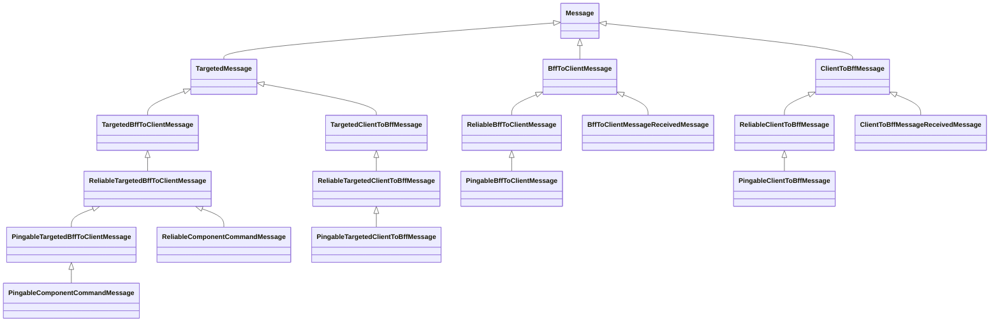
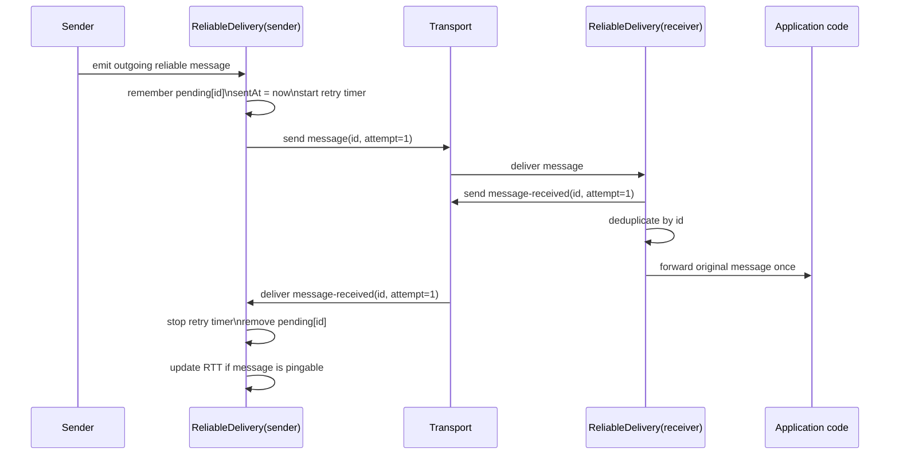
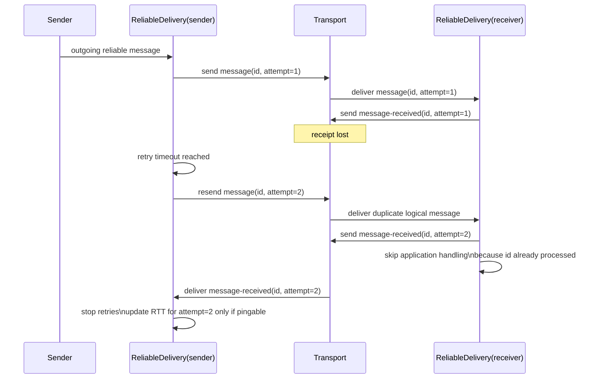
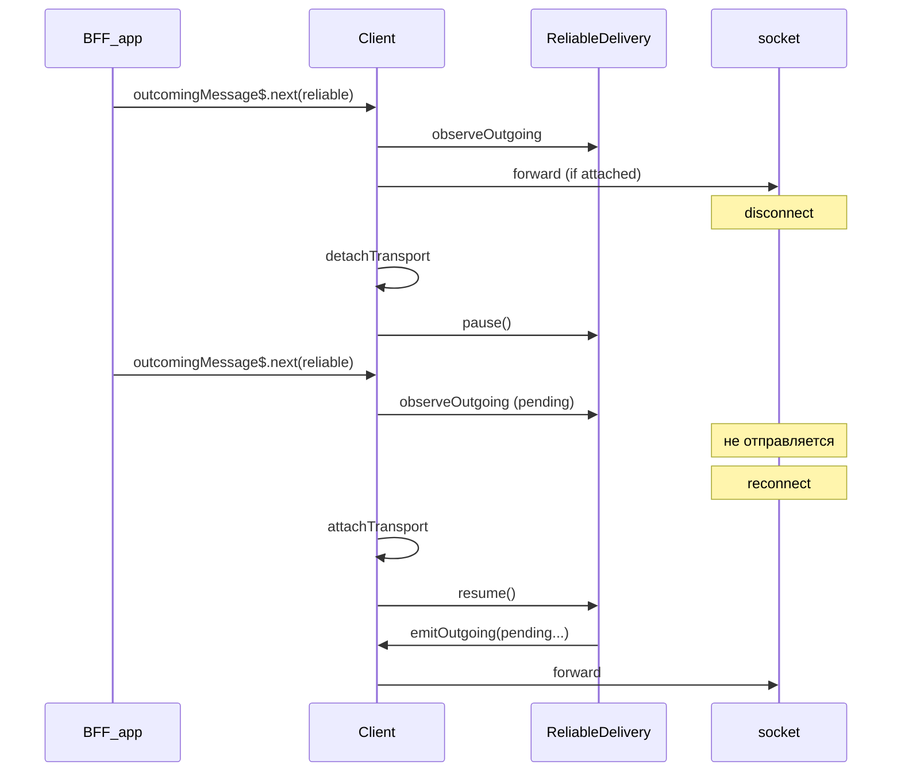

# Надёжная доставка сообщений

Этот документ описывает механизм надёжной доставки сообщений между BFF и клиентом в matreshka: какие сообщения считаются reliable, как работают подтверждения получения, повторные отправки, дедупликация входящих сообщений и расчёт RTT/ping.

## Зачем это понадобилось

Transport в matreshka может быть разным: `WS`, `WSS`, `SSE` и другие реализации поверх общего протокола. На уровне прикладного кода это означает важный риск: сообщение могло быть отправлено, но не дойти до получателя, либо дойти повторно после reconnect, retry или нестабильной сети.

Нужное поведение для runtime:

- отправитель должен понимать, что сообщение действительно дошло;
- при потере подтверждения или самого сообщения должна происходить повторная отправка;
- получатель не должен повторно выполнять один и тот же прикладной handler;
- измерение RTT должно опираться на лёгкие сообщения и не искажаться старыми retry-попытками.

## Где находится реализация

- `shared/messages/reliable-delivery.ts` — общий алгоритм retry, подтверждений, дедупликации и RTT.
- `shared/messages/reliable-message.ts` — общие типы reliable-сообщений.
- `shared/messages/bff-to-client/reliable-bff-to-client-message.ts` — базовый класс reliable-сообщений BFF -> client.
- `shared/messages/client-to-bff/reliable-client-to-bff-message.ts` — базовый класс reliable-сообщений client -> BFF.
- `shared/messages/bff-to-client/component-command-message.ts` — общий type guard `isComponentCommandMessage` для команд компоненту.
- `shared/messages/bff-to-client/pingable-component-command-message.ts` — лёгкие команды компоненту (pingable).
- `shared/messages/bff-to-client/reliable-component-command-message.ts` — тяжёлые команды компоненту без расчёта RTT.
- `shared/messages/bff-to-client/pingable-bff-to-client-message.ts` — marker-base для лёгких BFF -> client сообщений, пригодных для RTT.
- `shared/messages/client-to-bff/pingable-client-to-bff-message.ts` — marker-base для лёгких client -> BFF сообщений, пригодных для RTT.
- `shared/messages/bff-to-client/message-received-message.ts` — подтверждение получения от BFF.
- `shared/messages/client-to-bff/message-received-message.ts` — подтверждение получения от клиента.
- `client/src/app/services/postman.service.ts` — встраивание алгоритма на стороне клиента.
- `bff/core/client.ts` — встраивание алгоритма на стороне BFF.

## Базовая форма wire-сообщения

Любое сообщение на транспортном уровне сериализуется к `MessageData`.

```ts
type MessageData = {
  type: string;
  payload?: unknown;
  id?: string;
  attempt?: number;
};

type TargetedMessageData = MessageData & {
  target: string;
};
```

Поля `id` и `attempt` используются только для reliable-сообщений:

- `id` — идентификатор логического сообщения;
- `attempt` — номер конкретной попытки отправки этого логического сообщения.

Ключевая идея: при retry меняется только `attempt`, а `id` остаётся тем же самым.

## Классы сообщений



Смысл иерархии:

- `Reliable*Message` добавляют `id`, `attempt`, `nextAttempt()` и сериализацию reliable-полей;
- `Pingable*Message` ничего не меняют по wire-format, а только маркируют сообщение как пригодное для расчёта RTT;
- `PingableComponentCommandMessage` — лёгкие команды инстансу компонента (`DialogCloseMessage`, команды map/text-editor и т.п.);
- `ReliableComponentCommandMessage` — тяжёлые команды инстансу компонента. Сейчас это только `ForEachSyncComponentsMessage`: payload со строками списка не должен искажать RTT;
- `MessageReceivedMessage` намеренно не наследуются от `ReliableMessage`, чтобы подтверждение получения не требовало подтверждения само на себя и не образовывало бесконечный цикл.

## Жизненный цикл отправки

Ниже показан нормальный сценарий доставки одного reliable-сообщения.



## Жизненный цикл при потере подтверждения



## Алгоритм на стороне отправителя

### 1. Регистрация исходящего сообщения

Когда наружу уходит `ReliableMessage`, `ReliableDelivery.observeOutgoing()`:

- убеждается, что сообщение действительно reliable через `instanceof`;
- записывает сообщение в `pending` по ключу `message.id`;
- сохраняет `sentAt` для текущей попытки;
- отменяет старый таймер, если это уже повторная отправка;
- ставит новый `rxjs timer` на retry.

### 2. Retry

Если подтверждение не пришло вовремя:

- таймер вызывает `message.nextAttempt()`;
- наружу эмитится тот же объект сообщения;
- следующее прохождение через `observeOutgoing()` обновляет `sentAt` и пересоздаёт таймер.

Текущее значение retry-таймаута по умолчанию: `2000 ms`.

### 3. Завершение retry-цикла

Когда приходит `message-received` по известному `id`:

- retry-таймер отменяется;
- запись удаляется из `pending`;
- дальнейшие повторы этого сообщения больше не планируются.

Важно: сам факт подтверждения любого `attempt` завершает цикл retry. Это осознанное решение: если пришёл receipt, значит хотя бы одна попытка доставки с этим `id` достигла получателя.

## Алгоритм на стороне получателя

### 1. Ответ подтверждением

На каждое входящее reliable-сообщение отправляется отдельное `message-received` с парой:

```ts
{
  id: message.id,
  attempt: message.attempt,
}
```

Подтверждение отправляется всегда, даже если сообщение уже было обработано раньше. Это важно, потому что сеть могла потерять не само сообщение, а предыдущее подтверждение.

### 2. Дедупликация прикладной обработки

После отправки подтверждения получатель проверяет, видел ли он уже этот `message.id`.

- если `id` новый, сообщение отдаётся дальше в прикладной `incomingMessage$`;
- если `id` уже был обработан, прикладной код второй раз его не видит.

Таким образом transport может дублировать delivery, но BFF- или client-level handlers получают каждое логическое сообщение максимум один раз.

## Почему дедупликация хранит две структуры

`ReliableDelivery` использует сразу две связанные структуры:

- `receivedIds: Set<string>` — быстрый ответ на вопрос "видели ли мы этот `id`";
- `receivedOrder: string[]` — FIFO-порядок, чтобы удалить самый старый `id`, когда окно дедупликации переполнено.

Это ограниченное окно памяти:

- lookup остаётся быстрым за счёт `Set`;
- очистка старых id остаётся явной и предсказуемой за счёт отдельной очереди.

Текущее значение окна по умолчанию: `1000` последних `id`.

## RTT и `ping`

matreshka измеряет RTT не для всех reliable-сообщений, а только для тех, которые наследуются от `Pingable*Message`.

Причина в том, что тяжёлые сообщения вроде сериализованной страницы или `ForEachSyncComponentsMessage` могут нести большой payload, и их round-trip time отражает не только состояние сети, но и цену сериализации, передачи и обработки большого JSON.

Поэтому для RTT подходят только относительно лёгкие сообщения, у которых:

- payload небольшой;
- round trip ближе к реальной сетевой задержке;
- изменение значения RTT полезно для диагностики соединения.

### Почему в receipt хранится `attempt`

Если retry сработал, а затем почти сразу пришло подтверждение от более старой попытки, без `attempt` отправитель не смог бы понять, к какой именно отправке относится receipt.

Поэтому `message-received` несёт два значения:

- `id` — логическое сообщение;
- `attempt` — конкретная попытка, которую увидел получатель.

### Как это влияет на RTT

Логика расчёта такая:

- любой receipt по известному `id` останавливает retry;
- RTT обновляется только если исходное сообщение было `Pingable`;
- RTT обновляется только если `receipt.attempt === pending.message.attempt`.

Это защищает от ложного пинга в ситуации "receipt от старой попытки пришёл уже после новой повторной отправки".

## Валидация на границе

### На стороне BFF

`bff/core/client.ts` валидирует входящий JSON через `zod` до создания класса сообщения:

- базовые поля `type` и опциональный `payload` обязательны для всех сообщений; у targeted-сообщений дополнительно `target`;
- `id` и `attempt` допускаются либо вместе, либо оба отсутствуют.

То есть BFF не принимает half-state вида "есть `id`, но нет `attempt`".

### На стороне клиента

Клиентский runtime считается тонким и доверяет структуре, приходящей от BFF. Поэтому после парсинга конкретного класса reliable-поля просто восстанавливаются в `restoreDelivery()` без дополнительной runtime-валидации.

## Интеграция в runtime

### Клиент

`PostmanService` на клиенте:

- парсит входящий `MessageData` в экземпляр `BffToClientMessage`;
- пропускает сообщение через `ReliableDelivery.handleIncoming()`;
- отдаёт дальше только уникальные прикладные сообщения;
- наблюдает исходящий поток и регистрирует pending/retry;
- очищает `ReliableDelivery` при `detachSource()`.

### BFF

`Client` на стороне BFF:

- валидирует и парсит входящий JSON;
- пропускает его через `ReliableDelivery.handleIncoming()`;
- подписывается на `outcomingMessage$`, чтобы трекать reliable-исходящие сообщения;
- `attachTransport` / `detachTransport` управляют фактической отправкой в сокет или SSE;
- `disconnect$` → `ReliableDelivery.pause()`, `reconnect$` → `ReliableDelivery.resume()`;
- очищает состояние `ReliableDelivery` в `destroy()`.

### BFF: disconnect, grace period и reconnect

На BFF один `Client` может жить в памяти без активного transport (grace period, см. [`operations.md`](operations.md)). В этот период прикладной код продолжает писать в `outcomingMessage$`, но transport отключён через `detachTransport()`.

Для **reliable**-сообщений действуют два слоя:

| Слой | Ответственность | Реализация на BFF |
|------|-----------------|-------------------|
| Transport gate | «Есть ли живой сокет/SSE?» | `attachTransport` / `detachTransport` |
| Reliable delivery | «Ждём receipt, нужен retry?» | `ReliableDelivery.pause` / `resume` |



**Non-reliable** при disconnect на BFF не очередятся: transport gate не активен, а `ReliableDelivery` их не трекает.

На клиенте transport gate реализован отдельно — через `Source.pendingMessages` (см. [`client/src/app/transports/source.ts`](../../client/src/app/transports/source.ts)); `ReliableDelivery.pause/resume` там пока не подключён.

## Компромиссы и границы текущего решения

### Что это решение гарантирует

- reliable-сообщения не теряются бесследно при временной потере receipt;
- дубликаты не вызывают повторного прикладного выполнения;
- RTT считается только на релевантных типах сообщений;
- общий алгоритм одинаково работает в обе стороны канала.

### Чего оно не гарантирует

- exactly-once delivery на уровне транспорта;
- сохранность pending-состояния после рестарта процесса;
- бесконечную историю дедупликации;
- корректное восстановление после потери памяти у BFF.

Иными словами, это механизм "at least once transport + deduplicated application handling", а не полноценная distributed queue.

## Практические правила для разработки

1. Если новое сообщение должно переживать потери transport-а, наследуйте его от `ReliableMessage`.
2. Если сообщение лёгкое и подходит для измерения RTT, наследуйте его от `PingableMessage`.
3. Не делайте `message-received` reliable-сообщением.
4. Если вы добавляете обработку сообщений ниже прикладного уровня, исходите из модели `at least once`: один и тот же logical message может прийти повторно, поэтому дубликаты нужно отфильтровывать до business-логики или делать такую обработку идемпотентной.
5. Если сообщение слишком тяжёлое, не используйте его для расчёта RTT даже при reliable-доставке.
6. Команды компоненту: лёгкие наследуют `PingableComponentCommandMessage`, тяжёлые — `ReliableComponentCommandMessage`. Клиентский `componentCommandMessages$` принимает оба через `isComponentCommandMessage`.

## Связанные документы

- [`protocol.md`](protocol.md) — общий протокол и форма wire-сообщений.
- [`operations.md`](operations.md) — reconnect, lifecycle клиента и ограничения runtime.
- [`README.md`](README.md) — оглавление архитектурных документов.
