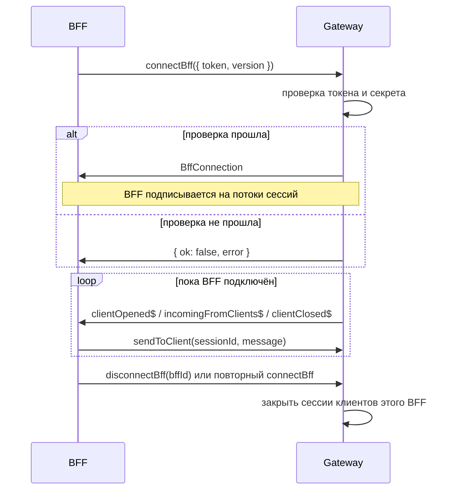
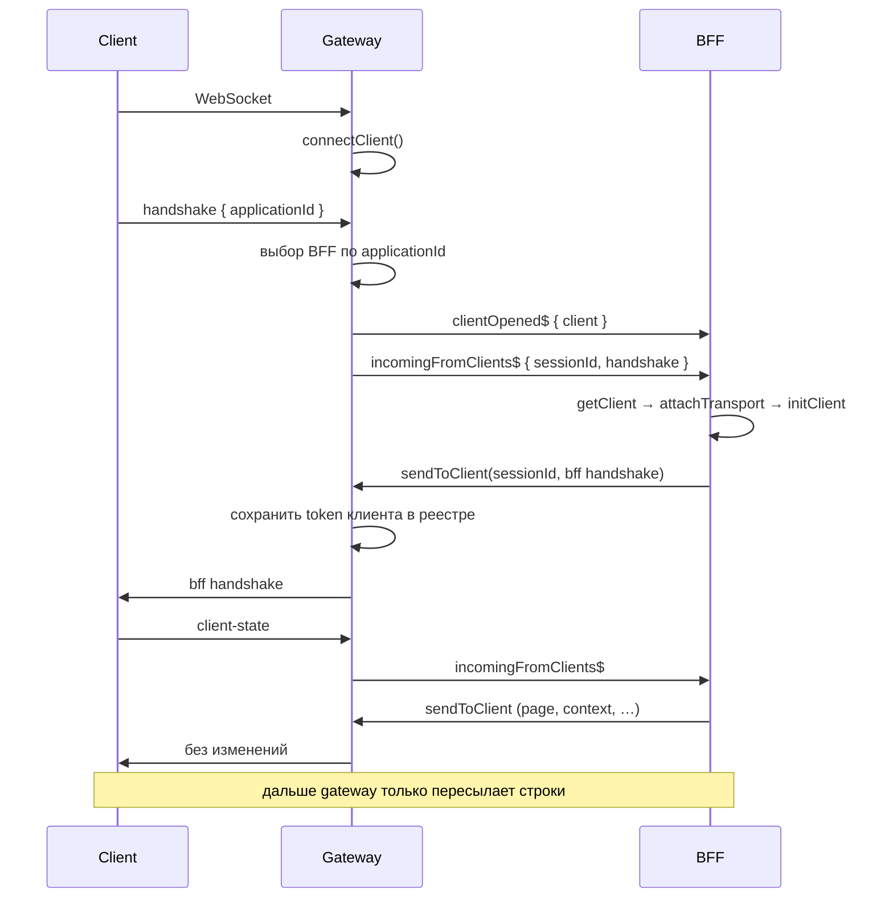
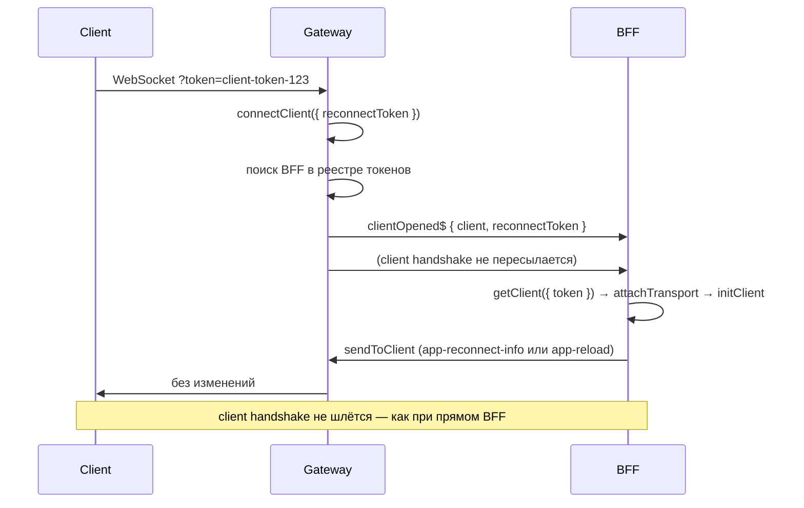
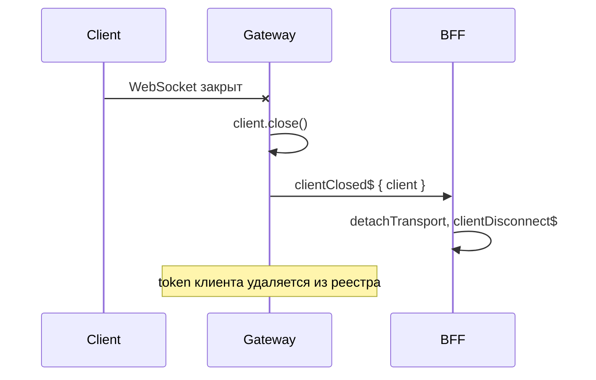

# Жизненный цикл сессий

У gateway два независимых цикла: **клиент ↔ gateway** и **BFF ↔ gateway**. Клиентскую сессию открывает transport-адаптер (например WebSocket). BFF регистрируется через `connectBff` и получает `BffConnection` с потоками событий.

## BFF регистрируется в gateway

### Этапы

1. **Регистрация** — BFF вызывает `gateway.connectBff({ token, version })`.
2. **Проверка** — gateway сверяет токен с `bffServers` в конфиге.
3. **BffConnection** — gateway возвращает объект с потоками и `sendToClient`.
4. **Пересылка** — gateway публикует события клиентских сессий в потоки BFF.
5. **Отключение** — `disconnectBff` или повторный `connectBff` с тем же id закрывает предыдущее подключение и все его клиентские сессии.

## Новый клиент

### Этапы

1. **Подключение** — transport-адаптер вызывает `gateway.connectClient()`.
2. **Client handshake** — первое сообщение клиента; gateway читает `applicationId` и привязывает сессию к BFF.
3. **Session open** — gateway публикует событие в `clientOpened$`.
4. **Инициализация BFF** — BFF создаёт `Client`, подключает transport через `sendToClient` и вызывает `initClient`.
5. **BFF handshake** — gateway сохраняет client `token` из BFF handshake для повторного подключения.
6. **Пересылка** — все следующие сообщения идут через `incomingFromClients$` / `sendToClient`.

Если для `applicationId` нет подключённого BFF, gateway закрывает клиентскую сессию.

## Повторное подключение клиента

### Отличия от новой сессии

- Client `token` передаётся в URL (`?token=...`).
- Gateway сразу находит BFF по реестру токенов.
- Client handshake **не** отправляется — как при прямом подключении к BFF (см. [`../architecture/protocol.md`](../architecture/protocol.md#handshake)).
- BFF получает `reconnectToken` в `clientOpened$` и передаёт его в `getClient(params)`.

## Клиент отключается

При закрытии WebSocket клиента transport-адаптер обязан вызвать `client.close()` на `ClientConnection`, полученном из `connectClient`.

## Сводная таблица

| Событие | Кто инициирует | Что делает gateway |
|---------|----------------|-------------------|
| WebSocket клиента открыт | Клиент | `connectClient` |
| Client handshake | Клиент | Выбор BFF по `applicationId`, `clientOpened$`, пересылка |
| Сообщение клиента | Клиент | `incomingFromClients$` → BFF |
| Ответ BFF | BFF | `sendToClient` → клиент; при BFF handshake — сохранение token |
| WebSocket клиента закрыт | Клиент | `clientClosed$` → BFF, очистка реестра |
| BFF отключён | BFF / gateway | `disconnectBff`, закрытие всех его сессий |
| Повторное подключение | Клиент | Поиск BFF по token, `clientOpened$` с `reconnectToken` |
